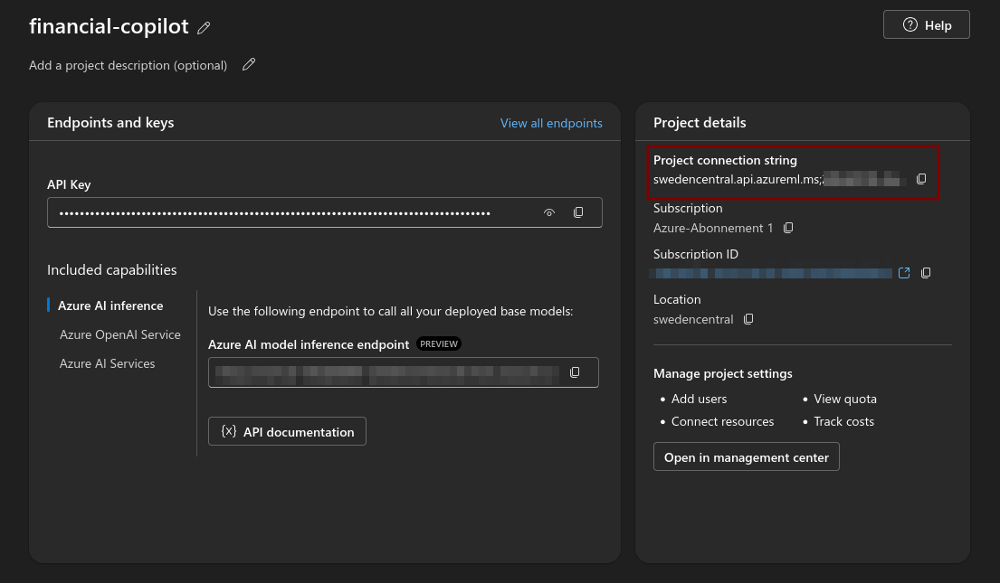
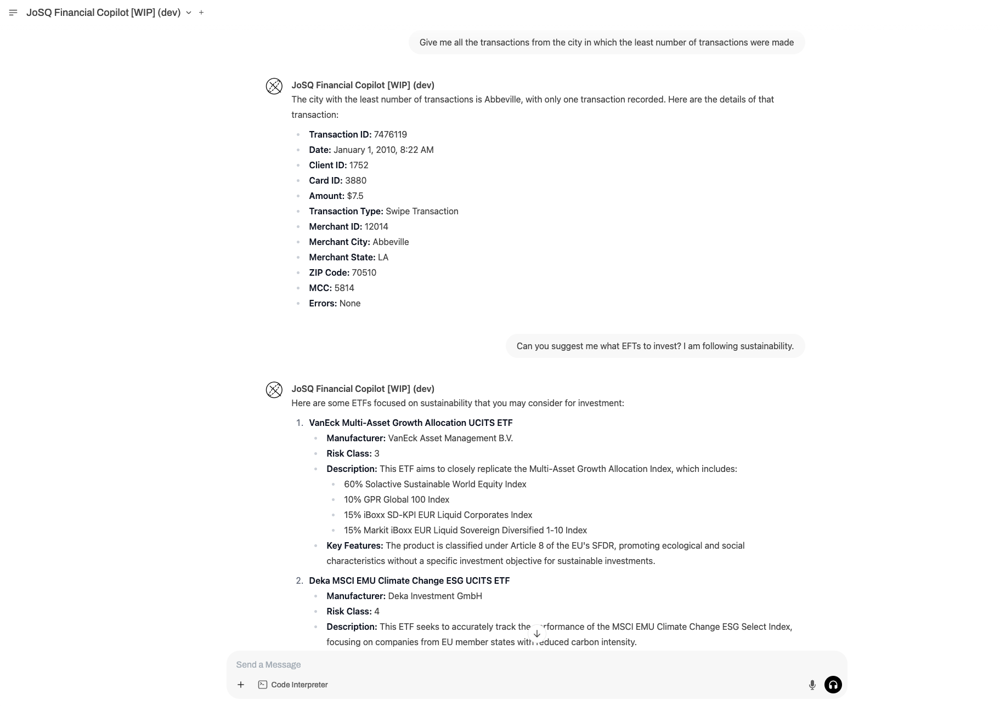

This repository is based on [Microsoft Azure’s NLP-SQL-in-a-Box](https://github.com/Azure-Samples/nlp-sql-in-a-box) and is currently under development by the **JoS QUANTUM Team**.

<p align="center">
    
</p>

---

## **What is this Solution?**

This solution is a **financial AI assistant** that helps users analyze and retrieve financial data using conversational AI. It is powered by **Azure Semantic Kernel SDK**, **NLP-to-SQL**, and a **retrieval-augmented generation (RAG) system** to provide relevant financial insights from structured and unstructured data.

### 🔹 Key Features

- **Conversational AI:** Understands user queries in natural language.
- **NLP-to-SQL:** Converts user queries into structured SQL statements.
- **SQL Execution Engine:** Runs generated SQL queries against a **SQL Server** database.
- **RAG System:** Retrieves data from ETF Key Information Documents (KIDs).
- **Secure & Scalable:** Build on **Azure AI Services** and **Azure SQL** to ensure performance and security.
- **Azure Semantic Kernel SDK:** Enhances AI agent capabilities with advanced orchestration, query routing and memory handling.

### 🔹 How It Works

1. **User Query:** The user asks a question in natural language (e.g. _"How many locations are there?"_).
2. **Semantic Kernel Routing:** The system calls the adequate plugin regarding the user query.
3. **Plugin Calling:**

   3.a. **RAG Document Retrieval:** If the query involves searching through financial documents, the system calls the RAG pipeline and retrieves relevant information.

   3.b. **SQL Database Query Generation & Execution:** If the query requires structured data, the system **converts the question into an SQL query**, which is then executed against the database.

4. **Response Generation:** The system formats the result and **returns a human-readable answer**.

## Setup Instructions

### Service Setup

#### 1. **AI Azure Foundry - Create and Deploy a Model**

1. Go to **Azure AI Studio (Azure Foundry)**:
   [https://ai.azure.com](https://ai.azure.com)

2. **Create a Project**:

   - Navigate to **Projects** → **+ New Project**.
   - Select a **Region**. We recommend you use either **East US2** or **Sweden Central**.
   - Name your project.

3. **Deploy a Model**:
   - Select **Model catalog**.
   - Choose a model, for example: **gpt-4o-mini**.

#### 2. **Vector Database for RAG - Azure AI Search Index**

1. Go to the **Azure Portal**:
   [https://portal.azure.com](https://portal.azure.com)

2. **Create Azure AI Search service**:

   - Search **Azure AI Search service**.
   - Select your resource group and instance details.

3. **Create Index**:
   - After the service is created, select **Add index** to create a search index.
   - Add any necessary fields.

#### 4. **SQL Database - Microsoft Azure**

1. Go to the **Azure Portal**:
   [https://portal.azure.com](https://portal.azure.com)

2. **Create SQL Database**:

   - In Azure Portal, search for **SQL Databases** → **+ Create**.
   - Fill:
     - **Database Name**: e.g., `josserver`
     - **Resource group**: Same as your other Azure resources.
     - **Region**: Same as your other Azure resources.

### Create the environment

Download and install `uv` and then install dependencies from `pyproject.toml`.

For macOS and Linux

```bash
wget -qO- https://astral.sh/uv/install.sh | sh
uv sync
source .venv/bin/activate
```

For Windows

```bash
powershell -ExecutionPolicy ByPass -c "irm https://astral.sh/uv/install.ps1 | iex"
uv sync
.venv\Scripts\Activate.ps1
```

### Environmental variables

You need to create an .env file in the root of the project and fill it with the output parameters. The .env file should look like this:

```bash
server_name = "" # MSSQL server, ours looks like "josserver.database.windows.net"
database_name = "" # MSSQL Database
uname = "" # username for database access
pwd = "" # password for database access

DEPLOYMENT_NAME = "gpt-4o-mini" # LLM deployment name (the deployment name is an example)

AIPROJECT_CONNECTION_STRING=""
AISEARCH_INDEX_NAME="rag-search-kid" - # vector databae index name
EMBEDDINGS_MODEL="text-embedding-ada-002" # embedding model name
```

The `AIPROJECT_CONNECTION_STRING` you can take from the source shown in the image below:

<p align="left">
    
</p>

## Deploy and run the solution

### Deploy Pre-requisites

1. An [Azure subscription](https://azure.microsoft.com/en-us/free/)
2. Install [Azure CLI](https://docs.microsoft.com/en-us/cli/azure/install-azure-cli-windows?view=azure-cli-latest)
3. Install [Bicep](https://docs.microsoft.com/en-us/azure/azure-resource-manager/bicep/install)
4. Install [Azure Developer CLI](https://learn.microsoft.com/en-us/azure/developer/azure-developer-cli/install-azd)

### Run Pre-requisites

1. Install [ODBC Driver for SQL Server](https://learn.microsoft.com/en-us/sql/connect/odbc/download-odbc-driver-for-sql-server)
2. Make sure you can access the resources deployed from your local machine.

- By default, all resources were created with no public access.
- You can allow your own IP address to access the resources by: - Find out your what's your IPv4 address - `azd env set IP_ADDRESS <ip_address>` - `azd up`

### Running the app

```bash
uv run python -m src.app
```

It should give the following:

```bash
INFO:     Started server process [2822133]
INFO:     Waiting for application startup.
INFO:     Application startup complete.
INFO:     Uvicorn running on http://0.0.0.0:9998 (Press CTRL+C to quit)
INFO:     127.0.0.1:40980 - "GET / HTTP/1.1" 200 OK
```

`http://0.0.0.0:9998` - this offers an API compatible to OpenAI standard. Any chat client capable of interfacing with OpenAI is compatible with it.

We suggest using [Open-WebUI](https://github.com/open-webui/open-webui).

### UI Deploy (in development)

[](https://portal.azure.com/#create/Microsoft.Template/uri/https%3A%2F%2Fraw.githubusercontent.com%2FAzure-Samples%2Fnlp-sql-in-a-box%2Fmain%2Finfra%2Fazuredeploy.json)

### Example Usage

Below you can see an example of the solution in action:

<p align="left">
    
</p>
